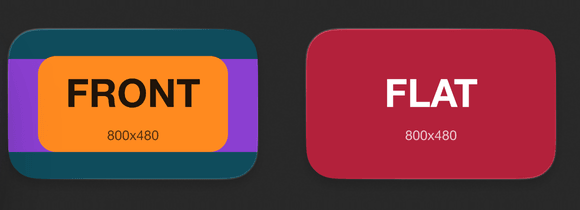
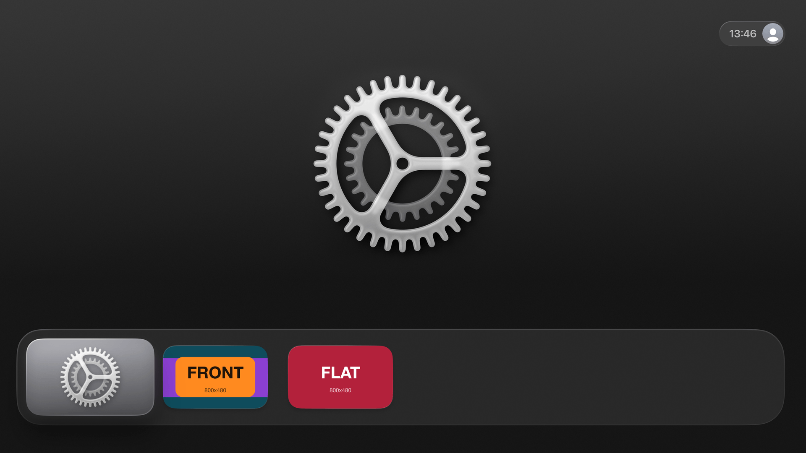
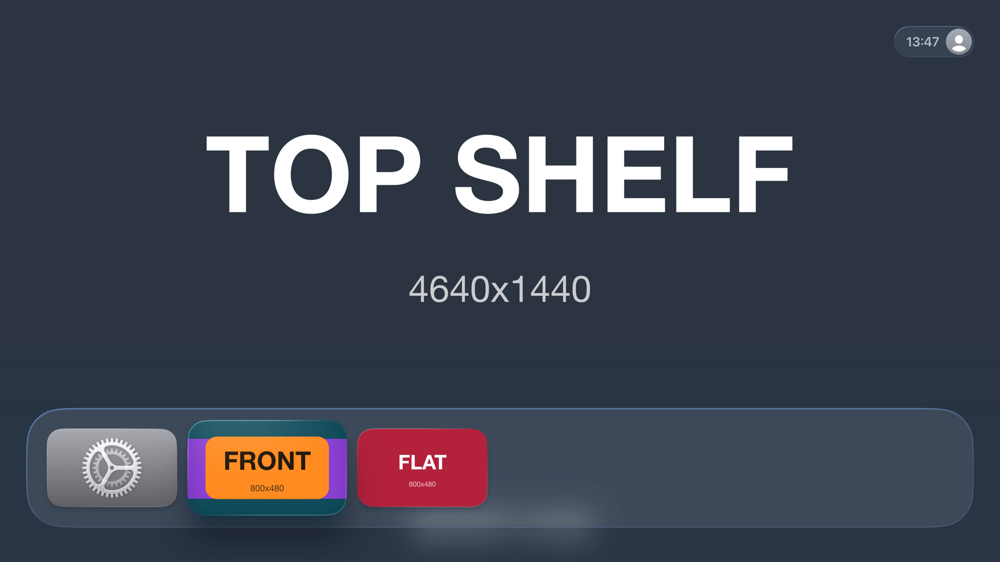
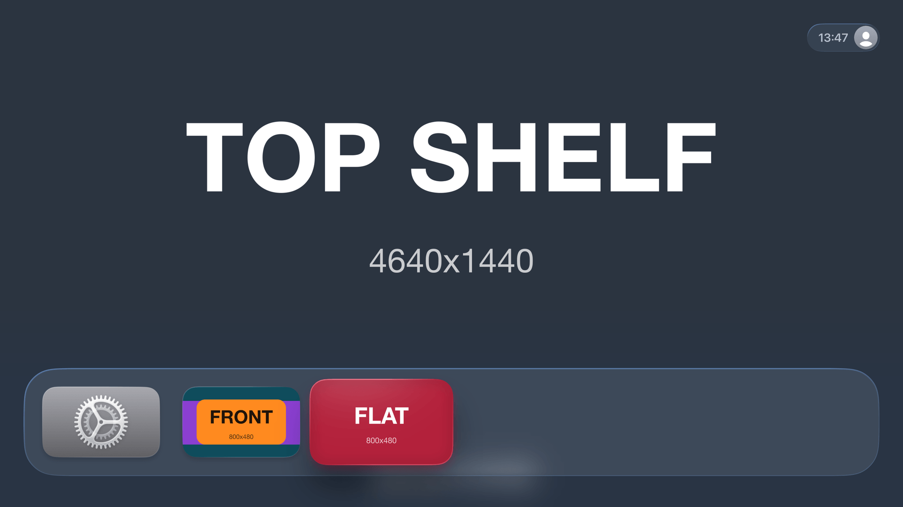

# config-tv-icon-layers-repro

An Apple TV app icon is an image stack of up to three layers, and tvOS shifts them apart when the
icon is focused. That shift is the parallax effect, and it needs different artwork in each layer.

`@react-native-tvos/config-tv@0.1.6` feeds the same image into the `Front`, `Middle` and `Back`
layers of both `App Icon - Small` and `App Icon - Large`, so the icon it generates is flat. Every
layer references the same file, and in the compiled `Assets.car` the three renditions of
`App Icon - Small` come out byte for byte identical.

This repo measures that, and measures the fix in
[config-tv#40](https://github.com/react-native-tvos/config-tv/pull/40), which adds
`iconSmallLayers`, `iconSmall2xLayers` and `iconLayers`.

Everything runs locally: **no Apple account, no signing, no EAS.** The plugin only runs during
`expo prebuild`, so prebuild plus `actool` and `assetutil` is the whole proof. A simulator is
optional and only there to look at the result.

## See it

`npm run show` builds both icon modes for the Apple TV simulator and installs them side by side.
Both apps below were built with PR #40. On 0.1.6 the left icon looks exactly like the right one,
because the layer keys are ignored.



Left, the layered icon: the teal `BACK` fills the tile, the purple `MIDDLE` band sits over it and
the orange `FRONT` box sits on top. Right, the flat icon: one crimson `FLAT` image. That is a crop
of the home screen:



Focus the layered icon and tvOS lifts the front layer away from the back, with a shadow between
them. The top shelf image renders too, so the rest of the brand assets work:



Focus the flat icon and it only scales. Every layer holds the same picture, so there is nothing to
separate:



The full parallax tilt needs a real remote's touch surface, which no simulator screenshot can
show. The compiled digests in check 2 are the machine-checkable proof; these pictures are the
human-readable one.

Screenshots taken on a clean Apple TV 4K simulator running tvOS 26.5, with nothing else installed.

## Run it

You need Xcode with the Apple TV platform installed and Node 20+. Dependencies install themselves.

```bash
./repro.sh          # against the published 0.1.6: checks 1 and 2 fail
npm test            # assert on out/result.json
```

Point it at the PR branch to see it pass:

```bash
git clone -b feat/apple-tv-icon-images https://github.com/filip-solecki/config-tv.git ../config-tv
(cd ../config-tv && yarn)   # its postinstall builds the plugin

./repro.sh --config-tv-version file:../config-tv/packages/config-tv
npm test
```

`--config-tv-version` takes a plain version (`0.1.7`), any npm spec, or a `file:` path to a source
checkout. A `file:` spec is copied rather than symlinked, so node can resolve the package's own
dependencies, and it falls back to `--ignore-scripts` when the checkout's `prepare` script cannot
run in the copy. A `file:` spec keeps whatever version its `package.json` says, so the version the
script prints tells you nothing about which code is installed. The checks do.

`./repro.sh` exits 0 when every check passes and 1 when one fails. The first run takes a few
minutes for `npm install`; later runs take under 20 seconds.

To look at the icons rather than measure them, run the repro first and then:

```bash
npm run show        # builds both modes for the Apple TV simulator and installs them
open -a Simulator
```

`npm run show` reuses whatever config-tv `./repro.sh` installed, so the icons you see come from
the same plugin build the checks ran against. It needs a tvOS simulator runtime and CocoaPods, and
the first build is slow: a `pod install` plus a full Release build of `react-native-tvos`. The two
modes share one Xcode project and one derived-data directory, so the second build is incremental.

## What it does

`expo prebuild --platform ios` runs twice from the same `app.config.js`, switched by `ICON_MODE`:

| mode | `appleTVImages` keys | what it is for |
| --- | --- | --- |
| `layers` | `iconLayers`, `iconSmallLayers`, `iconSmall2xLayers`, **and** the flat keys | checks 1 and 2 |
| `flat` | only `icon`, `iconSmall`, `iconSmall2x` | check 3 |

The two modes also get their own bundle id and display name, `Layered Icon` and `Flat Icon`, so
`npm run show` can put both on one home screen. Nothing else about them differs.

The `layers` mode passes both kinds of key on purpose. 0.1.6 requires all three flat keys and
ignores the layer keys, so this is the one config that produces a measurable result on both
versions instead of throwing, and it exercises the documented precedence: layers win for a scale
that has both.

Each catalog is then compiled with the invocation an Apple TV build uses:

```
actool <catalog>.xcassets --compile out --output-format human-readable-text \
  --notices --warnings --app-icon TVAppIcon --include-all-app-icons \
  --compress-pngs --enable-on-demand-resources YES --target-device tv \
  --minimum-deployment-target 15.1 --platform appletvos \
  --output-partial-info-plist p.plist --development-region en \
  --generate-swift-asset-symbol-extensions NO
```

`repro.sh` does all the measuring and writes `out/result.json`. `npm test` and the report
`repro.sh` prints both read that one file, so there is a single definition of what the checks mean.

## The checks

1. **the layers get their own artwork**: each `*.imagestacklayer/Content.imageset` in the
   generated `TVAppIcon.brandassets` references a different file, for both app icons
2. **the compiled catalog keeps them distinct**: `actool` compiles with zero errors and zero
   warnings, `assetutil --info` reports three different SHA1 digests per image stack per scale,
   and the partial `Info.plist` still declares `CFBundlePrimaryIcon` and both `TVTopShelfImage`
   keys
3. **backward compatibility**: with the flat config, every layer compiles from the same source
   file, and the three digests of `App Icon - Small` are identical, exactly as 0.1.6 behaves

Every failure message prints the actual values. Checks that compare a spread also assert that all
three layers are really present first, so a missing or truncated image stack fails instead of
passing for free.

### Why check 3 only compares digests for the small icon

Measured, not assumed. `actool` composites `App Icon - Large` under the `marketing` idiom, where
it forces an alpha channel onto every layer except `Back`. One source image therefore produces two
different digests there even on 0.1.6:

```
App Icon - Large/Back/Content    Opaque=true   6B8E2B31…  flat-1280x768.png
App Icon - Large/Front/Content   Opaque=false  5E9FFFED…  flat-1280x768.png
App Icon - Large/Middle/Content  Opaque=false  5E9FFFED…  flat-1280x768.png
```

`App Icon - Small` compiles under the `tv` idiom, where `Opaque` follows the source, so its three
layers really are byte-identical. Check 3 asserts identical *source files* for both icons and
identical *digests* only for the small one. `out/result.json` records `source` and `opaque` per
layer so this is visible in the data rather than taken on trust.

## Sample output

### `./repro.sh` against the published 0.1.6

```
==> config-tv spec: @react-native-tvos/config-tv@0.1.6
    installed: 0.1.6
==> prebuild with the layers app icon config
==> prebuild with the flat app icon config

  --- layers config ---
  App Icon - Small
    Front  1x:flat-400x240.png 2x:flat-800x480.png
    Middle 1x:flat-400x240.png 2x:flat-800x480.png
    Back   1x:flat-400x240.png 2x:flat-800x480.png
    1x digests  B:6EEC5808  F:6EEC5808  M:6EEC5808  (ALL IDENTICAL)
    2x digests  B:0CB9A3E5  F:0CB9A3E5  M:0CB9A3E5  (ALL IDENTICAL)
  App Icon - Large
    Front  1x:flat-1280x768.png
    Middle 1x:flat-1280x768.png
    Back   1x:flat-1280x768.png
    1x digests  B:6B8E2B31  F:5E9FFFED  M:5E9FFFED  (only 2 of 3 differ)
  --- flat config ---
  ... trimmed: identical to the layers config above ...

  actool diagnostics: none
  partial plist keys: CFBundleIcons CFBundleIcons.CFBundlePrimaryIcon TVTopShelfImage TVTopShelfImage.TVTopShelfPrimaryImage TVTopShelfImage.TVTopShelfPrimaryImageWide

  [BUG]  1  each layer gets its own artwork           the layer keys had no effect
  [BUG]  2  the compiled catalog keeps them distinct  one rendition repeated per stack
  [ OK]  3  a flat config still behaves like 0.1.6    one image in all three layers

==> 2 check(s) fail with @react-native-tvos/config-tv@0.1.6
```

The two configs produce the same catalog, which is the bug: the layer keys did nothing.

### `./repro.sh --config-tv-version file:../config-tv/packages/config-tv`, PR #40

```
  --- layers config ---
  App Icon - Small
    Front  1x:front-400x240.png 2x:front-800x480.png
    Middle 1x:middle-400x240.png 2x:middle-800x480.png
    Back   1x:back-400x240.png 2x:back-800x480.png
    1x digests  B:B8D9CAF3  F:E3E9F937  M:F4361398  (all differ)
    2x digests  B:1FD612DD  F:DED5BFB2  M:07B5A472  (all differ)
  App Icon - Large
    Front  1x:front-1280x768.png
    Middle 1x:middle-1280x768.png
    Back   1x:back-1280x768.png
    1x digests  B:465FDE72  F:93A30014  M:76DBA712  (all differ)
  --- flat config ---
  App Icon - Small
    Front  1x:flat-400x240.png 2x:flat-800x480.png
    Middle 1x:flat-400x240.png 2x:flat-800x480.png
    Back   1x:flat-400x240.png 2x:flat-800x480.png
    1x digests  B:6EEC5808  F:6EEC5808  M:6EEC5808  (ALL IDENTICAL)
    2x digests  B:0CB9A3E5  F:0CB9A3E5  M:0CB9A3E5  (ALL IDENTICAL)
  App Icon - Large
    Front  1x:flat-1280x768.png
    Middle 1x:flat-1280x768.png
    Back   1x:flat-1280x768.png
    1x digests  B:6B8E2B31  F:5E9FFFED  M:5E9FFFED  (only 2 of 3 differ)

  actool diagnostics: none
  partial plist keys: CFBundleIcons CFBundleIcons.CFBundlePrimaryIcon TVTopShelfImage TVTopShelfImage.TVTopShelfPrimaryImage TVTopShelfImage.TVTopShelfPrimaryImageWide

  [ OK]  1  each layer gets its own artwork           Front, Middle and Back all differ
  [ OK]  2  the compiled catalog keeps them distinct  3 renditions per stack, actool clean
  [ OK]  3  a flat config still behaves like 0.1.6    one image in all three layers

==> all checks pass with file:../config-tv/packages/config-tv
```

The flat digests are the same values in both runs, `6EEC5808`, `0CB9A3E5`, `6B8E2B31` and
`5E9FFFED`, so a config that only uses the flat keys compiles to the same renditions it did on
0.1.6.

### `npm test`

```
config-tv under test: file:../config-tv/packages/config-tv (version 0.1.6)

▶ Apple TV app icon layers
  ✔ 1. each layer of each app icon gets its own artwork
  ✔ 2. the compiled catalog keeps the layers distinct
  ✔ 3. a config that uses only the flat keys behaves exactly as 0.1.6 did
```

Against 0.1.6, checks 1 and 2 fail with the values they saw:

```
✖ 1. each layer of each app icon gets its own artwork
  AssertionError: Every layer must reference its own file, but the generated catalog says:
    App Icon - Small: Front=1x:flat-400x240.png 2x:flat-800x480.png, Middle=1x:flat-400x240.png 2x:flat-800x480.png, Back=1x:flat-400x240.png 2x:flat-800x480.png
    App Icon - Large: Front=1x:flat-1280x768.png, Middle=1x:flat-1280x768.png, Back=1x:flat-1280x768.png
  The layer keys in app.config.js were ignored, so the icon is flat.

✖ 2. the compiled catalog keeps the layers distinct
  AssertionError: The digests of the three layers must all differ, but the compiled car holds:
    App Icon - Small 1x: Back=6EEC5808…, Front=6EEC5808…, Middle=6EEC5808…
    App Icon - Small 2x: Back=0CB9A3E5…, Front=0CB9A3E5…, Middle=0CB9A3E5…
    App Icon - Large 1x: Back=6B8E2B31…, Front=5E9FFFED…, Middle=5E9FFFED…
  Identical digests mean tvOS has nothing to shift apart on focus.
```

Check 3 passes on both versions, since keeping the flat behaviour is the point. To confirm it can
fail, patch a copy of the plugin so the flat path leaks different art into the middle layer:

```bash
cp -R ../config-tv/packages/config-tv /tmp/config-tv-broken
rm -f /tmp/config-tv-broken/node_modules
perl -pi -e 's/Middle: iconScale\.image,/Middle: iconScale.image.replace("flat-", "middle-"),/' \
    /tmp/config-tv-broken/build/withTVAppleIconImages.js
./repro.sh --config-tv-version file:/tmp/config-tv-broken
```

```
✖ 3. a config that uses only the flat keys behaves exactly as 0.1.6 did
  AssertionError: 0.1.6 puts one image in all three layers, so every layer of a flat config must
  still compile from the same file. They came from:
    App Icon - Small 1x: Back=flat-400x240.png, Front=flat-400x240.png, Middle=middle-400x240.png
    App Icon - Small 2x: Back=flat-800x480.png, Front=flat-800x480.png, Middle=middle-800x480.png
    App Icon - Large 1x: Back=flat-1280x768.png, Front=flat-1280x768.png, Middle=middle-1280x768.png
  That is a behaviour change for a config that never asked for layers.
```

## How this project is set up

A plain Expo app for Apple TV with **no committed native directory**. `repro.sh` runs
`expo prebuild --platform ios` on every run and deletes `ios/` afterwards, so the catalog under
test is always the one the plugin just generated.

`assets/tv/` holds 16 committed placeholder PNGs, generated by `npm run art` with `sharp`:

- `front-*`, `middle-*`, `back-*` at 400x240, 800x480 and 1280x768, in clearly different colours.
  Front and middle are transparent apart from their artwork and back is opaque, the way a real
  tvOS icon is built
- `flat-*` at the same three sizes, for what every layer gets from one image per scale
- four top shelf images at 1920x720, 3840x1440, 2320x720 and 4640x1440. 0.1.6 requires these
  whenever `appleTVImages` is set, so the flat config still has to supply them

The sizes are exact, since `actool` fails on anything else. Note that 0.1.6's doc comment for
`icon` says 1280x760 while the asset it declares is 1280x768; PR #40 corrects the comment, and
1280x768 is what works.

| file | what it does |
| --- | --- |
| `repro.sh` | prebuild, compile, collect, report |
| `app.config.js` | both app icon configs, switched by `ICON_MODE` |
| `tools/collect-result.mjs` | reads `out/<mode>/` and writes `out/result.json` |
| `tools/checks.mjs` | derives the three checks, shared by the report and the tests |
| `tools/report.mjs` | prints the table and the check lines, exits non-zero on failure |
| `tools/make-art.mjs` | regenerates the placeholder PNGs |
| `tools/show.mjs` | builds both modes for the Apple TV simulator and installs them |
| `tests/icon-layers.test.mjs` | `node:test` assertions over `out/result.json` |
| `docs/` | the simulator screenshots above, resized to 1920x1080 |

Verified with `@react-native-tvos/config-tv@0.1.6`, `expo@56.0.20`,
`react-native-tvos@0.85.3-3`, Xcode 26.6 (`actool` 24765), the tvOS 26.5 SDK and Node 24.12.0 on
macOS.
